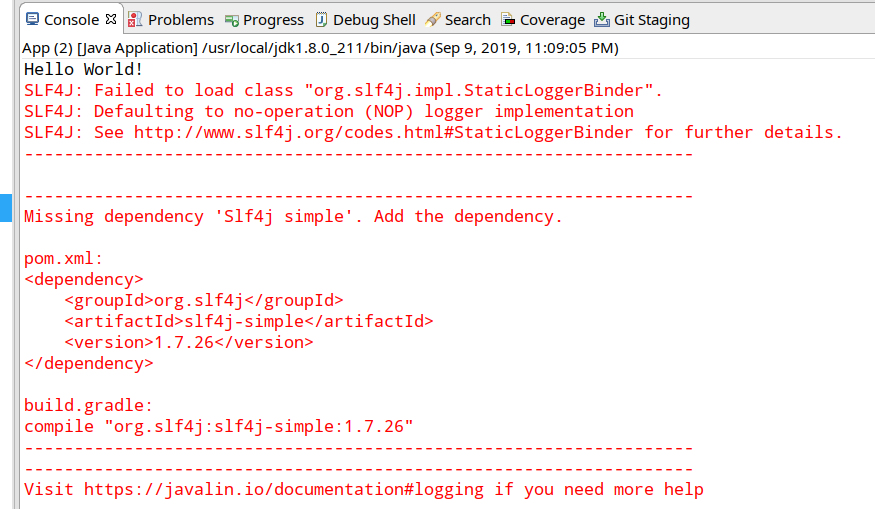
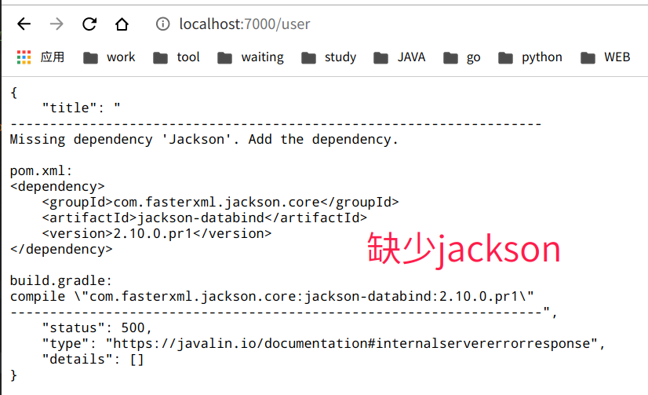

# JavalinDemo

## javalin

官网：https://javalin.io/

https://github.com/javalin/javalin

Javalin是一种 **编程式** 的micro web framework。javalin的活跃度要比[sparkjava](https://github.com/perwendel/spark)更好。但是[sparkjava](https://github.com/perwendel/spark)的github star数更多。

[SparkJava and Javalin comparison](https://javalin.io/comparisons/sparkjava)


> 其实这种编程式的框架，可以尝试用kotlin来编写下更好。

### 2023/05/31

Jdk17支持 rexdb

jvm参数
```shell
--add-opens java.base/java.lang=ALL-UNNAMED --add-opens java.base/java.lang.reflect=ALL-UNNAMED 
```

https://blog.csdn.net/qq_41611125/article/details/126635762

### 2023/05/25

中文乱码
https://github.com/javalin/javalin/issues/1899

### 2022/01/26

* Handler的方法不需要区分 http method。所以这里就是接收参数和处理业务即可。也不需要额外再新建Service层了。可以理解Handler本身就是Service层。这里和
  tornado有相似之处，也有不同之处。相似在都是一种用Handler的注册形式，不同在于两者注册的时候，tornado没有指定http method，需要再handler里面用方法区分，无疑增加了handler的复杂度
  ，而javalin在注册时候明确指定handler是啥http method，因此handler可以直接作为Service层来处理任务。Handler里面就可以直接使用rexdb来操作数据库。
* 这个micro框架就不是用来处理重量级的事情的。适合做个啥报表查询之类的。不需要特别广泛的生态啥的。

层 | 实现方式
--- | ---
Handler（Service逻辑层） | javalin
DAO | rexdb (很可惜，这个框架活跃度比较低了)

### 打包

```shell
mvn clean package -Dmaven.test.skip=true
```

### 初次想法

这种没有采用的依赖注入形式的框架，虽然效率高，~~但是怎么和Spring的控制反转与依赖注入结合呢？~~此外数据库DAO层怎么结合呢？

下面解决方案可以参考

~~Service层使用静态方法管理，Controller直接调用，但是更加底层的DAO怎么处理？~~

有一个ORM框架，可以解决这个问题，就是 [rexdb](https://rexdb.gitee.io/)，也是静态方法直接调用，只是rexdb，相对于mybatis来说可能自己手写sql语句比较多。

层 | 实现方式
--- | ---
Contoller | javalin
~~Service~~ | ~~静态方法调用即可~~
DAO | rexdb

## notes



